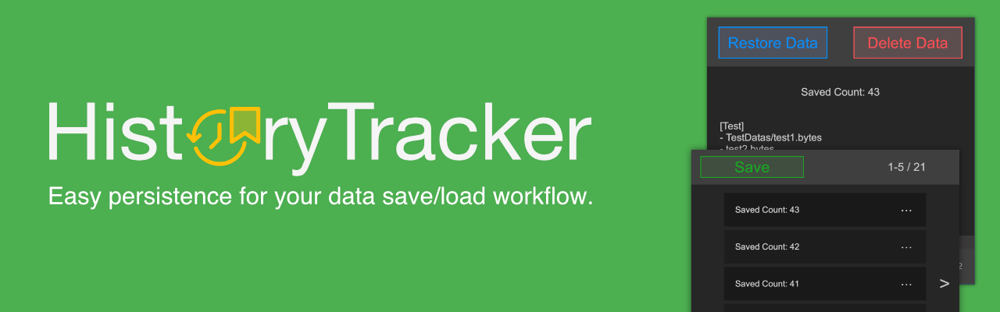
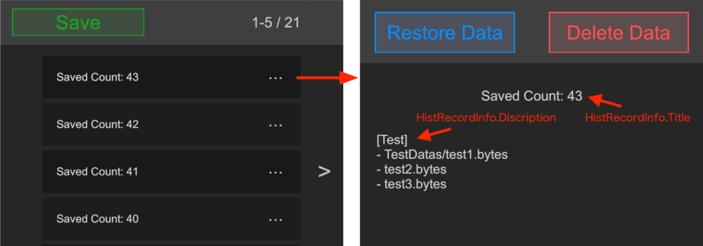
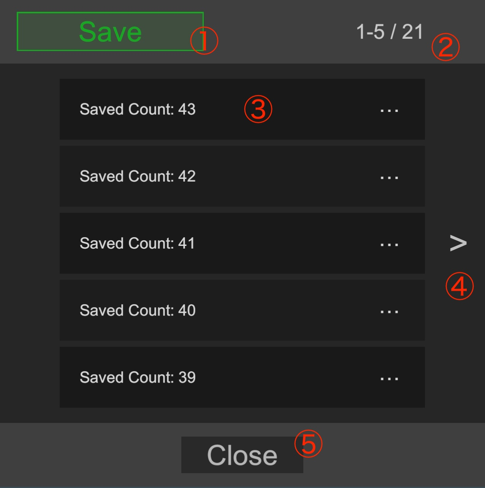
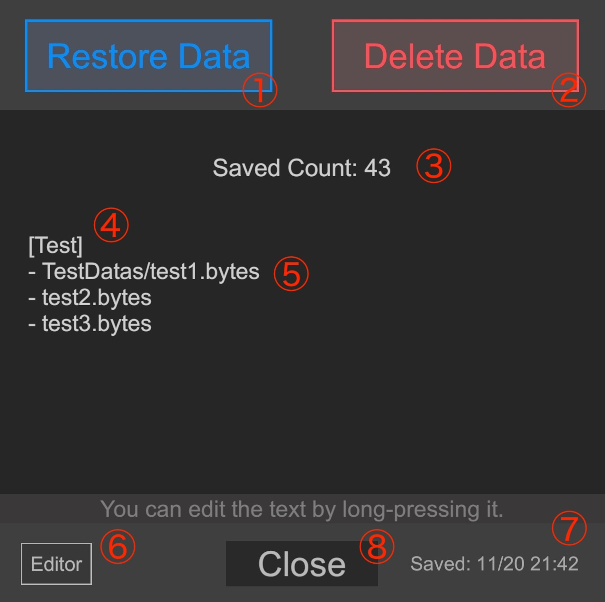
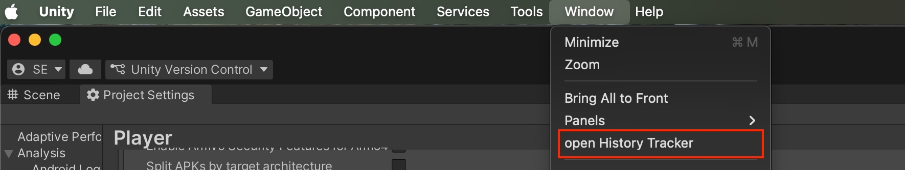
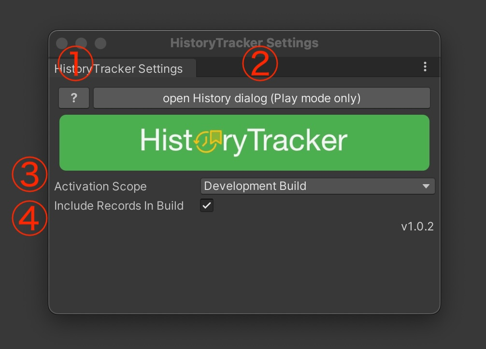

> [!IMPORTANT]
> このプラグインは保存されたゲームデータを保存/復元するプラグインです。データのシリアライズ/デシリアライズなどのセーブシステムに該当する機能は含まれておりません。

# HistoryTracker
ゲームデータ(永続保存データ)を保存/復元するUnity向けプラグイン



## Features
- ゲームデータ(永続保存データ)の保存
- 保存したゲームデータの復元
- 見やすいUIで管理
- Editorで保存したデータを実機で使用

## Why HistoryTracker?

### 1. 確率要素の集中デバッグ
「1%の確率でドロップするアイテム」や「ある条件で発生するイベント」を確認したい場合、ゲームをやり直すのは時間の無駄です。 判定が行われる直前の状態で保存し、判定後にロードして何度も試行することで、低確率イベントの挙動確認を短時間で何十回も行えます。

### 2. クエスト分岐・マルチエンディングの網羅テスト
RPGやアドベンチャーゲームで、「選択肢Aを選んだ場合」と「選択肢Bを選んだ場合」の両方をテストしたい時に役立ちます。 分岐ポイントの直前で状態を保存しておけば、一方のルートを確認した後、即座に分岐前に戻ってもう一方のルートを確認でき、デバッグの手戻りを最小限に抑えられます。

### 3. QA（品質保証）時の「バグ再現」ツールとして
テスターがバグを発見した際、「どうやってその状態になったか」を再現するのは困難です。このプラグインは実機でも使える為、**定期的に保存**しておく事で、バグが発生した瞬間に巻き戻して、開発者に正確な発生状況を共有したり、再現手順を特定したりすることが容易になります。

### 4. ゲームバランス調整（パラメータ調整）の高速化
ボス戦の難易度調整などで、「攻撃力を少し上げてリトライしたい」という場面です。 戦闘開始前の状態を保持しておき、インスペクターで敵のパラメータを調整しては「復元して再戦」を繰り返すことで、理想のゲームバランスを探ることができます。

### 5. テストの初期化処理
統合テストを行う際、テストごとに「所持金1000G、レベル10の状態」を作る必要があります。 毎回新規データからセットアップするのではなく、あらかじめ作っておいた「理想の状態」をこのプラグインで復元してテストを開始すれば、テストの実行時間を大幅に短縮し、クリーンな環境でテストを行えます。

## Getting Started

### Install from Git URL

"Unity Editor : Window > Package Manager > Add package from git URL...".

```
https://github.com/IShix-g/HistoryTracker.git?path=Packages/HistoryTracker
```


## Scripts

### 実装

セーブシステムとHistoryTrackerを関連付ける`IHistSaveDataHandler`を実装します。

| メソッド               | 説明                                                                                          |
|--------------------|---------------------------------------------------------------------------------------------|
| OnBeforeSave()     | セーブする直前に呼ばれます。保存が必要なゲームデータを保存し、タイトルと説明を返します。この内容はUIに表示されます                                  |
| GetSaveFilePaths() | ゲームデータのフルパスを配列で返します。例) `Application.persistentDataPath` + "/data.bytes"                     
| ApplyData()        | ゲームデータが復元された後に呼ばれます。ゲームデータをロードし直す、または、`Application.Quit()`を呼んで一度アプリを閉じるなどの処理でゲームデータを反映させます。 |

```csharp
using HistoryTracker;

public sealed class TestModelRepository : ModelRepository, IHistSaveDataHandler
{
    public HistRecordInfo OnBeforeSave()
    {
        // Save data
        for (var i = 0; i < Models.Count; i++)
        {
            var model = Models[i];
            var path = GetFullPath(model.Id);
            Save(model, path);
        }
        // Return the title and description
        var title = "Saved Count: " + Models[0].SaveCount;
        var description = "[Test]";
        return new HistRecordInfo(title, description);
    }

    // Determine and return the file path
    // e.g. `Application.persistentDataPath` + "/data.bytes" 
    public IReadOnlyList<string> GetSaveFilePaths() => Paths.Values.ToList();

    public void ApplyData() => Restored();
}
```

### HistRecordInfo

上記の`OnBeforeSave()`で設定したタイトルと説明は、UIで下記のように表示されます。

```csharp
var title = "Saved Count: " + Models[0].SaveCount;
var description = "[Test]";
return new HistRecordInfo(title, description);
```



### 依存の設定

上記で実装した`IHistSaveDataHandler`をHistoryTrackerに設定します。Awakeなどゲーム起動後できる限り早いタイミングで設定してください。

```csharp
void Awake()
{
    // Initialize the repository that implements IHistSaveDataHandler in Awake
    Hist.Configure(_repository);
}
```

### ヒストリーダイアログを開く

ダイアログはコードで開きます。必要無くなったタイミングで`Hist.Release()`で解放する事も可能ですが、軽いので問題になる可能性は低いと思います。

```csharp
using HistoryTracker;

void OnDialogButtonClicked()
{
    Hist.OpenDialog();
}
```

## ヒストリーダイアログの説明

### ヒストリー 一覧

保存された履歴が一覧で表示されます。



| No | 説明           |
|----|--------------|
| ①  | ゲームデータを保存 |
| ②  | 件数の表示        |
| ③  | 保存したゲームデータ   |
| ④  | 詳細を開く     |
| ⑤  | 次のページへ       |
| ⑥  | 前のページへ       |
| ⑦  | 閉じる          |

### 詳細

保存されたゲームデータの詳細と操作。



| No | 説明                      |
|----|-------------------------|
| ①  | ゲームデータの復元               |
| ②  | ゲームデータの削除               |
| ③  | タイトル (長押しで編集可) *        |
| ④  | 説明 (長押しで編集可) *          |
| ⑤  | 保存したデータのパス一覧            |
| ⑥  | Editorで保存された場合、表示されるバッチ |
| ⑦  | 閉じる                     |
| ⑧  | 保存日                     |

* 実機の場合、Editorで生成されたデータを編集できません。

## プラグインの設定

このプラグインは、デフォルトでデバック環境でのみ動作します。それを設定で調整できます。

### `Window > HistoryTracker > open Settings`で開く


### 設定



| No | 説明                                                  |
|----|-----------------------------------------------------|
| ①  | GitHubページの表示  (外部リンク)                               |
| ②  | ヒストリーダイアログを開く (ランタイムのみ)                             |
| ③  | プラグインの有効範囲 (EditorOnly / DevelopmentBuild / Allから選択) |
| ④  | Editorで保存したゲームデータを実機で使用するか？                 |

## スクリプトからゲームデータを保存する

ヒストリーダイアログのSaveボタンでゲームデータを保存できますが、下記コードからでも保存できます。

```csharp
Hist.SaveHistory();
```

## Use Cases

### レベルアップ時にゲームデータを保存する

セーブシステムにレベルアップイベントがあれば、レベルアップ毎に保存する事で問題が発生した場合に巻き戻ししやすくなります。

<b>コード例:</b>
```csharp
void OnLevelUp(int level)
{
    // タイトルと説明を追加できます。
    var title = $"Level Up {level}";
    var description = JsonUtility.ToJson(_user, true);
    var info = new HistRecordInfo(title, description);
    Hist.SaveHistory(info);
}
```

### エラーが発生した時にゲームデータを保存する

予め準備したコードを使う場合は、下記を実行してください。エラーの発生を監視して、`Hist.SaveHistory()`を呼ぶシングルトンのコンポーネントです。

<b>コード例:</b>
```csharp
void Start()
{
    HistErrorSaver.Create();
}
```
